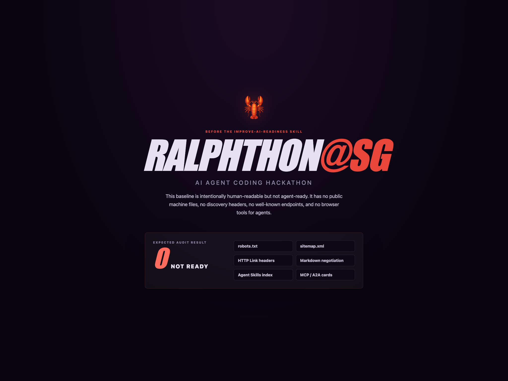
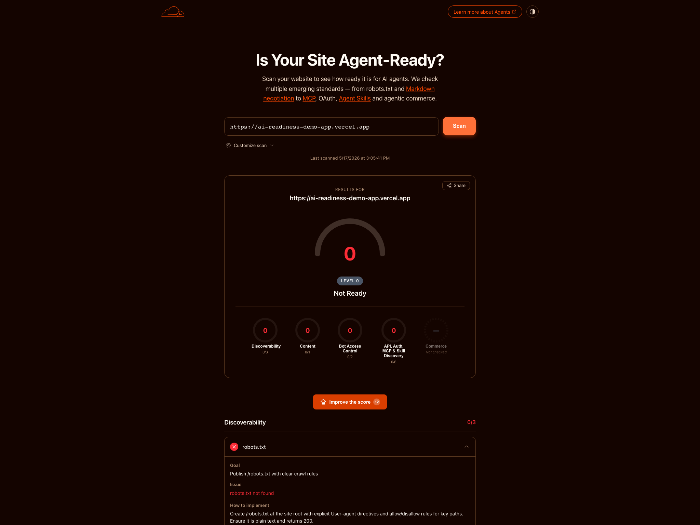
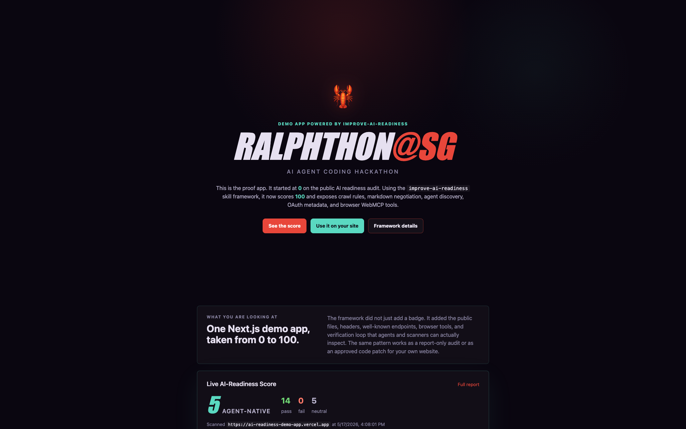
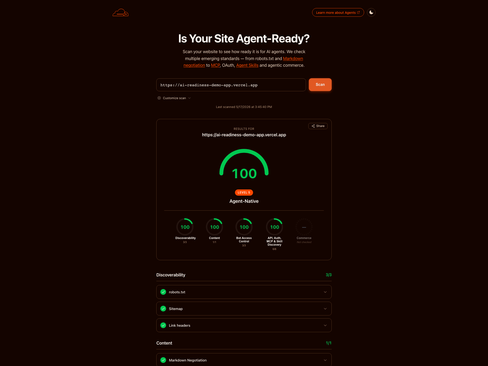
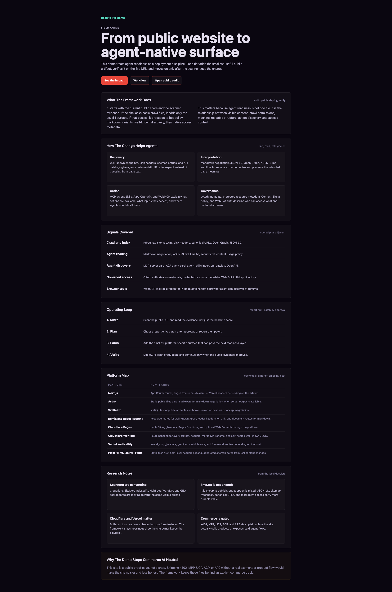
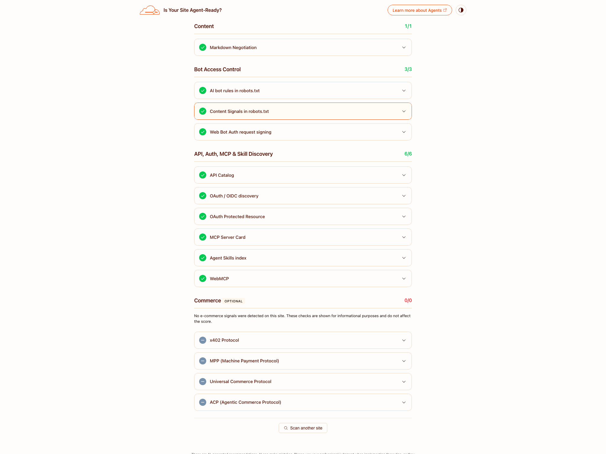

# AI Readiness Field Guide

Ralphthon@SG hackathon submission for turning a normal public website into an agent-ready website with measurable evidence.

The demo starts as a Level 0 deployment and ends at Level 5 with a public score of 100 on the AI-readiness audit. The framework is not tied to one scanner or one hosting provider. It gives web apps a structured contract that agents, crawlers, directories, and audit tools can read.

[Watch the demo video](https://youtu.be/pUUvW0KFlYA) | [Open the demo app](https://ai-readiness-demo-app.vercel.app) | [Run the public audit](https://isitagentready.com/?url=https%3A%2F%2Fai-readiness-demo-app.vercel.app)

[](https://youtu.be/pUUvW0KFlYA)

## Hackathon Result

| Before | After |
| --- | --- |
| Level 0, no agent-readiness surface | Level 5, Agent-Native |
| 0 passing checks | 14 passing checks |
| Agents infer from rendered HTML | Agents read files, cards, tools, and metadata |

The reusable framework adds the files and endpoints agents look for: `robots.txt` with AI-bot rules, `sitemap.xml`, `llms.txt`, `AGENTS.md`, `/.well-known/mcp.json`, A2A metadata, an agent-skills index, WebMCP, OAuth metadata, and an API catalog. After every change, it re-runs the audit so the score movement is visible.

## Built With Codex App

This project was built through the Codex app with very little manual implementation work. The human role was setting the goal, reviewing the output, giving product and design feedback, and publishing the final video.

Codex handled the planning loop, repository audit, framework authoring, platform-specific fixes, Next.js demo implementation, screenshots, Remotion video project, motion design, local rendering, and documentation updates. This submission is meant to show Codex as more than a coding helper: it can drive a complete product loop from problem framing to shipped code, evidence capture, demo production, and documentation while keeping a human in review.

## What This Is

AI Readiness Field Guide is a practical framework for making public websites easier for agents, crawlers, and audit tools to discover, understand, and use.

The work is broader than one scanner. The same files and headers help with SiteDex-style audits, Cloudflare checks, SEO crawlers, agent directories, browser tool discovery, and future content usage policy checks.

## About

- Demo app: [ai-readiness-demo-app.vercel.app](https://ai-readiness-demo-app.vercel.app)
- Public audit result: [isitagentready.com result](https://isitagentready.com/?url=https%3A%2F%2Fai-readiness-demo-app.vercel.app)
- AI readiness audit: [isitagentready.com](https://isitagentready.com)
- Demo video: [youtu.be/pUUvW0KFlYA](https://youtu.be/pUUvW0KFlYA)

## Use It In Agentic Editors

The guide is packaged for Claude Code, but the workflow is not limited to one tool. Use it with Claude Code, Codex, Cursor, Windsurf, OpenCode, Aider, Roo Code, Cline, Hermes-style agents, or any coding agent that can read a local folder and follow Markdown instructions.

For Claude Code, install the folder inside the site repo you want to improve:

```bash
cd /path/to/your-website
mkdir -p .claude/skills
cp -R /path/to/improve-ai-readiness/improve-ai-readiness .claude/skills/improve-ai-readiness
```

Or install it for your user account:

```bash
mkdir -p ~/.claude/skills
cp -R /path/to/improve-ai-readiness/improve-ai-readiness ~/.claude/skills/improve-ai-readiness
```

For Codex, Cursor, OpenCode, or another coding agent, keep the folder in the repo and point the agent at the entry file:

```text
Read improve-ai-readiness/SKILL.md and follow it for https://example.com.
Start with a readiness report. Ask before editing files or hosted settings.
Target the next failing readiness layer, not every possible protocol at once.
```

Then open your agent in the target website repo and ask for the next tier:

```text
Use improve-ai-readiness on https://example.com.
Detect the platform, run the public audit, and first generate a readiness report.
After the report, ask before patching only the next level.
Target Level 4 unless the scan shows a smaller nextLevel.
Do not add commerce protocols unless this site is commerce.
```

For a known stack, give the agent the platform up front:

```text
Use improve-ai-readiness for this Next.js App Router site.
Production URL: https://example.com
Generate a readiness report, then ask before raising it from the current
isitagentready.com level to the next passing level.
```

The entry point is `improve-ai-readiness/SKILL.md`. It loads `GOTCHAS.md`, detects the platform, audits the public URL, reads the matching level reference, then either writes a report or asks before applying the smallest patch that can pass the next level. After deployment, run the audit again and continue one level at a time.

You can also run the scripts directly from this repo:

```bash
improve-ai-readiness/scripts/pick-platform.sh /path/to/your-website
improve-ai-readiness/scripts/audit.sh https://example.com
improve-ai-readiness/scripts/verify-tier.sh https://example.com 3
```

## Demo Result

- Final result captured in `results/`: Level 5, 14 pass, 0 fail, 5 neutral
- Baseline branch: `codex/level-0-demo-app`
- Final branch: `main`

## What Is In This Repository

```text
improve-ai-readiness/     Agent-compatible field guide and templates
example-web-app/          Next.js Pages Router demo deployed on Vercel
research/                 Local research dossiers used to shape the framework
results/                  Before and after screenshots for the demo and audit
```

The `improve-ai-readiness/` directory contains the reusable guide: tier references, platform notes, templates, scripts, and gotchas. It is designed to be read progressively. The entry file stays short, and the platform-specific details live in separate files.

## The Route From Level 0 To Level 5

The framework treats readiness as a sequence, not a bulk file dump.

| Stage | Public surface | Why it matters |
| --- | --- | --- |
| Level 1 | `robots.txt`, `sitemap.xml`, Link headers | Crawlers can find the site map and machine endpoints. |
| Level 2 | AI bot rules and Content-Signal policy | The site states crawler and training preferences. |
| Level 3 | Markdown negotiation | Agents can request a clean text representation of key pages. |
| Level 4 | MCP card, A2A card, agent-skills, api-catalog | Agents can discover tools, skills, and API descriptions. |
| Level 5 | OAuth metadata, protected resource metadata, Web Bot Auth, WebMCP | The site exposes governed access and browser-visible tools. |

Commerce files such as x402, MPP, UCP, ACP, and AP2 are opt-in. They should only appear when the site has a real commerce or payment flow.

## Demo App

The demo app is intentionally small. It proves the mechanics without hiding them behind a large product surface.

- `/api/score` proxies the public audit API.
- `/robots.txt`, `/sitemap.xml`, `/llms.txt`, and `/AGENTS.md` expose basic discovery and guidance files.
- `middleware.js` adds Link headers, markdown negotiation, API catalog, OAuth discovery, protected resource metadata, and a Web Bot Auth key directory.
- `/webmcp.js` registers browser-side WebMCP tools for agents that inspect the page runtime.
- `/details` explains the framework, platform map, and research notes.

Run it locally:

```bash
cd example-web-app
npm install
npm run dev
```

Build it:

```bash
cd example-web-app
npm run build
```

Scan a public URL:

```bash
curl -sX POST https://isitagentready.com/api/scan \
  -H "Content-Type: application/json" \
  -d '{"url":"https://ai-readiness-demo-app.vercel.app"}'
```

## Platform Coverage

The guide is not tied to Vercel or Next.js. It has explicit recipes for:

- Next.js App Router
- Next.js Pages Router
- Astro
- SvelteKit
- Remix and React Router 7
- Cloudflare Pages
- Cloudflare Workers
- Vercel config
- Netlify config
- Plain HTML, Jekyll, and Hugo

Each platform note explains where to put static files, where to set headers, and how to handle `Accept: text/markdown` when the framework supports server routes.

## Why This Is Broader Than `isitagentready.com`

Cloudflare's scanner is a useful public scoreboard, but the durable value is the site surface itself:

- Search engines and answer engines still need accurate crawl policy, sitemap dates, canonical URLs, Open Graph, and JSON-LD.
- Agent runtimes need predictable `.well-known/` locations for MCP, A2A, skills, API catalogs, and auth metadata.
- Browser agents need runtime tool registration, which is why the demo includes WebMCP.
- CMS and platform tools are converging on the same checks, so a platform-neutral guide ages better than a single-host recipe.

The research folder tracks Cloudflare, SiteDex, IndexedAI, WordLift, HubSpot, GEO scoreboards, CMS plugins, MCP, A2A, AIPREF, Content Signals, and Web Bot Auth. The guide keeps the high-signal pieces and avoids pretending that every draft protocol belongs on every site.

## Proof

The proof set shows both the demo site and the external audit moving from Level 0 to Level 5.

### Before

<table>
  <tr>
    <td width="50%">
      
    </td>
    <td width="50%">
      
    </td>
  </tr>
  <tr>
    <td><strong>Demo app baseline</strong></td>
    <td><strong>Public audit baseline</strong></td>
  </tr>
</table>

### After

<table>
  <tr>
    <td width="50%">
      
    </td>
    <td width="50%">
      
    </td>
  </tr>
  <tr>
    <td><strong>Final demo app</strong></td>
    <td><strong>Public audit result</strong></td>
  </tr>
</table>

### Detail Views

<table>
  <tr>
    <td width="50%">
      
    </td>
    <td width="50%">
      
    </td>
  </tr>
  <tr>
    <td><strong>Framework details page</strong></td>
    <td><strong>Passing checks</strong></td>
  </tr>
</table>

Additional full-page captures are available in `results/`.
